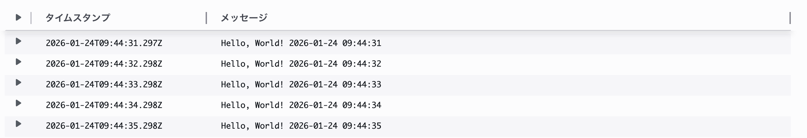
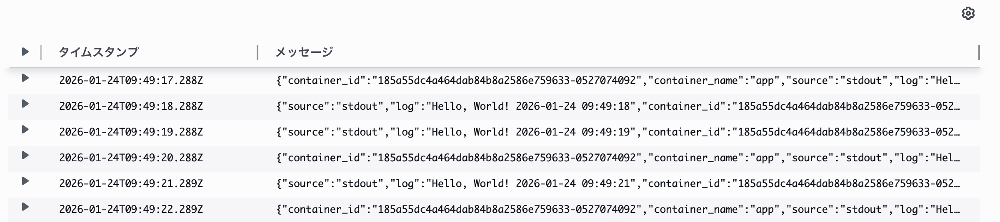

# 目的
既存のECSタスクにotel collectorおよび関連サイドカーを導入し、既存タスクに影響を与えない形でotel collectorでログを収集できるようにする。

# 構成
* app: アプリケーションのコンテナ
* firelens: ログルータ、appのログを受信してルーティングする
* otel-collector: firelensが送信してきたログを受信して処理する

# 結論
上記の構成にすることで、既存のECSタスクには影響を与えないが、ECSタスク関連のオペレーションへの影響が発生することがわかった。

ECSタスクのログはログタブから確認することができるが、ここで確認できるのはawslogsログドライバに送信されたログのみである。したがって、appのログドライバをfirelensに変更した時点でログタブからログを確認することはできない。

firelensによってログはこれまでと同じロググループに送信されているので、そちらからログを確認することはできる。ただしログのフォーマットが異なっている。
* awslogs: 
  * ログのみが表示されている
* firelens: 
  * ログの他にメタデータも付与されており、構造化されている

ログの内容それ自体は変わっていない。

アプリのログドライバをawslogsのままにする場合、otel collectorはそのままではログを収集することができない。一応、`awscloudwatchreceiver`を使用してcloudwatch logsを参照するという方法があることはあるが、APIリクエスト料金がかかるほか、API制限が生じるので現実的とは言えない。

また、ログだけ見るならサブスクリプションフィルター(LambdaやKinesis Data Firehose経由で外部（OTel Collectorやバックエンド）に転送)を使うというてもある。

# 出てるログ
```
--------------------------------------------------------------------------------------------------------------------------------------------------------------------------------------------------------------------------------------------------------------------------------------------------------------------------------------------
|   timestamp   |                                                                                                                                                         message                                                                                                                                                          |
|---------------|--------------------------------------------------------------------------------------------------------------------------------------------------------------------------------------------------------------------------------------------------------------------------------------------------------------------------|
| 1769338791123 | ObservedTimestamp: 1970-01-01 00:00:00 +0000 UTC                                                                                                                                                                                                                                                                         |
| 1769338791123 | Timestamp: 2026-01-25 10:59:50.446994556 +0000 UTC                                                                                                                                                                                                                                                                       |
| 1769338791123 | SeverityText:                                                                                                                                                                                                                                                                                                            |
| 1769338791123 | SeverityNumber: Unspecified(0)                                                                                                                                                                                                                                                                                           |
| 1769338791123 | Body: Str(Hello, World! 2026-01-25 10:59:50)                                                                                                                                                                                                                                                                             |
| 1769338791123 | Trace ID:                                                                                                                                                                                                                                                                                                                |
| 1769338791123 | Span ID:                                                                                                                                                                                                                                                                                                                 |
| 1769338791123 | Flags: 0                                                                                                                                                                                                                                                                                                                 |
| 1769338791123 |  {"resource": {"service.instance.id": "80fb9447-a242-4f73-a970-8db3b97cc0f6", "service.name": "otelcol-contrib", "service.version": "0.142.0"}, "otelcol.component.id": "debug", "otelcol.component.kind": "exporter", "otelcol.signal": "logs"}                                                                         |
| 1769338792123 | 2026-01-25T10:59:52.123Z info Logs {"resource": {"service.instance.id": "80fb9447-a242-4f73-a970-8db3b97cc0f6", "service.name": "otelcol-contrib", "service.version": "0.142.0"}, "otelcol.component.id": "debug", "otelcol.component.kind": "exporter", "otelcol.signal": "logs", "resource logs": 1, "log records": 1} |
| 1769338792123 | 2026-01-25T10:59:52.123Z info ResourceLog #0                                                                                                                                                                                                                                                                             |
| 1769338792123 | Resource SchemaURL: https://opentelemetry.io/schemas/1.6.1                                                                                                                                                                                                                                                               |
| 1769338792123 | Resource attributes:                                                                                                                                                                                                                                                                                                     |
| 1769338792123 |      -> cloud.provider: Str(aws)                                                                                                                                                                                                                                                                                         |
| 1769338792123 |      -> cloud.platform: Str(aws_ecs)                                                                                                                                                                                                                                                                                     |
| 1769338792123 |      -> aws.ecs.task.arn: Str(arn:aws:ecs:ap-northeast-1:438465126106:task/firelens-otel-test-cluster/788a48233cb743738c27a90be41b3e07)                                                                                                                                                                                  |
| 1769338792123 |      -> aws.ecs.task.family: Str(firelens-otel-test-task)                                                                                                                                                                                                                                                                |
| 1769338792123 |      -> aws.ecs.task.revision: Str(10)                                                                                                                                                                                                                                                                                   |
| 1769338792123 |      -> cloud.account.id: Str(438465126106)                                                                                                                                                                                                                                                                              |
| 1769338792123 |      -> cloud.region: Str(ap-northeast-1)                                                                                                                                                                                                                                                                                |
| 1769338792123 |      -> aws.ecs.task.id: Str(788a48233cb743738c27a90be41b3e07)                                                                                                                                                                                                                                                           |
| 1769338792123 |      -> aws.ecs.cluster.arn: Str(arn:aws:ecs:ap-northeast-1:438465126106:cluster/firelens-otel-test-cluster)                                                                                                                                                                                                             |
| 1769338792123 |      -> cloud.availability_zone: Str(ap-northeast-1a)                                                                                                                                                                                                                                                                    |
| 1769338792123 |      -> aws.ecs.launchtype: Str(fargate)                                                                                                                                                                                                                                                                                 |
| 1769338792123 |      -> aws.log.group.names: Slice(["/ecs/firelens-otel-test/firelens-container"])                                                                                                                                                                                                                                       |
| 1769338792123 |      -> aws.log.group.arns: Slice(["arn:aws:logs:ap-northeast-1:438465126106:log-group:/ecs/firelens-otel-test/firelens-container"])                                                                                                                                                                                     |
| 1769338792123 |      -> aws.log.stream.names: Slice(["firelens/firelens/788a48233cb743738c27a90be41b3e07"])                                                                                                                                                                                                                              |
| 1769338792123 |      -> aws.log.stream.arns: Slice(["arn:aws:logs:ap-northeast-1:438465126106:log-group:/ecs/firelens-otel-test/firelens-container:log-stream:firelens/firelens/788a48233cb743738c27a90be41b3e07"])                                                                                                                      |
| 1769338792123 | ScopeLogs #0                                                                                                                                                                                                                                                                                                             |
| 1769338792123 | ScopeLogs SchemaURL:                                                                                                                                                                                                                                                                                                     |
| 1769338792123 | InstrumentationScope                                                                                                                                                                                                                                                                                                     |
| 1769338792123 | LogRecord #0                                                                                                                                                                                                                                                                                                             |
| 1769338792123 | ObservedTimestamp: 1970-01-01 00:00:00 +0000 UTC                                                                                                                                                                                                                                                                         |
| 1769338792123 | Timestamp: 2026-01-25 10:59:51.447103587 +0000 UTC                                                                                                                                                                                                                                                                       |
| 1769338792123 | SeverityText:                                                                                                                                                                                                                                                                                                            |
| 1769338792123 | SeverityNumber: Unspecified(0)                                                                                                                                                                                                                                                                                           |
| 1769338792123 | Body: Str(Hello, World! 2026-01-25 10:59:51)                                                                                                                                                                                                                                                                             |
| 1769338792123 | Trace ID:                                                                                                                                                                                                                                                                                                                |
| 1769338792123 | Span ID:                                                                                                                                                                                                                                                                                                                 |
| 1769338792123 | Flags: 0                                                                                                                                                                                                                                                                                                                 |
| 1769338792123 |  {"resource": {"service.instance.id": "80fb9447-a242-4f73-a970-8db3b97cc0f6", "service.name": "otelcol-contrib", "service.version": "0.142.0"}, "otelcol.component.id": "debug", "otelcol.component.kind": "exporter", "otelcol.signal": "logs"}                                                                         |
| 1769338793123 | 2026-01-25T10:59:53.123Z info Logs {"resource": {"service.instance.id": "80fb9447-a242-4f73-a970-8db3b97cc0f6", "service.name": "otelcol-contrib", "service.version": "0.142.0"}, "otelcol.component.id": "debug", "otelcol.component.kind": "exporter", "otelcol.signal": "logs", "resource logs": 1, "log records": 1} |
| 1769338793123 | 2026-01-25T10:59:53.123Z info ResourceLog #0                                                                                                                                                                                                                                                                             |
| 1769338793123 | Resource SchemaURL: https://opentelemetry.io/schemas/1.6.1                                                                                                                                                                                                                                                               |
| 1769338793123 | Resource attributes:                                                                                                                                                                                                                                                                                                     |
| 1769338793123 |      -> cloud.provider: Str(aws)                                                                                                                                                                                                                                                                                         |
| 1769338793123 |      -> cloud.platform: Str(aws_ecs)                                                                                                                                                                                                                                                                                     |
| 1769338793123 |      -> aws.ecs.task.arn: Str(arn:aws:ecs:ap-northeast-1:438465126106:task/firelens-otel-test-cluster/788a48233cb743738c27a90be41b3e07)                                                                                                                                                                                  |
| 1769338793123 |      -> aws.ecs.task.family: Str(firelens-otel-test-task)                                                                                                                                                                                                                                                                |
| 1769338793123 |      -> aws.ecs.task.revision: Str(10)                                                                                                                                                                                                                                                                                   |
| 1769338793123 |      -> cloud.account.id: Str(438465126106)                                                                                                                                                                                                                                                                              |
| 1769338793123 |      -> cloud.region: Str(ap-northeast-1)                                                                                                                                                                                                                                                                                |
| 1769338793123 |      -> aws.ecs.task.id: Str(788a48233cb743738c27a90be41b3e07)                                                                                                                                                                                                                                                           |
| 1769338793123 |      -> aws.ecs.cluster.arn: Str(arn:aws:ecs:ap-northeast-1:438465126106:cluster/firelens-otel-test-cluster)                                                                                                                                                                                                             |
| 1769338793123 |      -> cloud.availability_zone: Str(ap-northeast-1a)                                                                                                                                                                                                                                                                    |
| 1769338793123 |      -> aws.ecs.launchtype: Str(fargate)                                                                                                                                                                                                                                                                                 |
| 1769338793123 |      -> aws.log.group.names: Slice(["/ecs/firelens-otel-test/firelens-container"])                                                                                                                                                                                                                                       |
| 1769338793123 |      -> aws.log.group.arns: Slice(["arn:aws:logs:ap-northeast-1:438465126106:log-group:/ecs/firelens-otel-test/firelens-container"])                                                                                                                                                                                     |
| 1769338793123 |      -> aws.log.stream.names: Slice(["firelens/firelens/788a48233cb743738c27a90be41b3e07"])                                                                                                                                                                                                                              |
| 1769338793123 |      -> aws.log.stream.arns: Slice(["arn:aws:logs:ap-northeast-1:438465126106:log-group:/ecs/firelens-otel-test/firelens-container:log-stream:firelens/firelens/788a48233cb743738c27a90be41b3e07"])                                                                                                                      |
| 1769338793123 | ScopeLogs #0                                                                                                                                                                                                                                                                                                             |
| 1769338793123 | ScopeLogs SchemaURL:                                                                                                                                                                                                                                                                                                     |
| 1769338793123 | InstrumentationScope                                                                                                                                                                                                                                                                                                     |
| 1769338793123 | LogRecord #0                                                                                                                                                                                                                                                                                                             |
| 1769338793123 | ObservedTimestamp: 1970-01-01 00:00:00 +0000 UTC                                                                                                                                                                                                                                                                         |
| 1769338793123 | Timestamp: 2026-01-25 10:59:52.447238258 +0000 UTC                                                                                                                                                                                                                                                                       |
| 1769338793123 | SeverityText:                                                                                                                                                                                                                                                                                                            |
| 1769338793123 | SeverityNumber: Unspecified(0)                                                                                                                                                                                                                                                                                           |
| 1769338793123 | Body: Str(Hello, World! 2026-01-25 10:59:52)                                                                                                                                                                                                                                                                             |
| 1769338793123 | Trace ID:                                                                                                                                                                                                                                                                                                                |
| 1769338793123 | Span ID:                                                                                                                                                                                                                                                                                                                 |
| 1769338793123 | Flags: 0                                                                                                                                                                                                                                                                                                                 |
| 1769338793123 |  {"resource": {"service.instance.id": "80fb9447-a242-4f73-a970-8db3b97cc0f6", "service.name": "otelcol-contrib", "service.version": "0.142.0"}, "otelcol.component.id": "debug", "otelcol.component.kind": "exporter", "otelcol.signal": "logs"}                                                                         |
| 1769338794123 | 2026-01-25T10:59:54.123Z info ResourceLog #0                                                                                                                                                                                                                                                                             |
| 1769338794123 | Resource SchemaURL: https://opentelemetry.io/schemas/1.6.1                                                                                                                                                                                                                                                               |
| 1769338794123 | Resource attributes:                                                                                                                                                                                                                                                                                                     |
| 1769338794123 |      -> cloud.provider: Str(aws)                                                                                                                                                                                                                                                                                         |
| 1769338794123 |      -> cloud.platform: Str(aws_ecs)                                                                                                                                                                                                                                                                                     |
| 1769338794123 |      -> aws.ecs.task.arn: Str(arn:aws:ecs:ap-northeast-1:438465126106:task/firelens-otel-test-cluster/788a48233cb743738c27a90be41b3e07)                                                                                                                                                                                  |
| 1769338794123 |      -> aws.ecs.task.family: Str(firelens-otel-test-task)                                                                                                                                                                                                                                                                |
| 1769338794123 |      -> aws.ecs.task.revision: Str(10)                                                                                                                                                                                                                                                                                   |
| 1769338794123 |      -> cloud.account.id: Str(438465126106)                                                                                                                                                                                                                                                                              |
| 1769338794123 |      -> cloud.region: Str(ap-northeast-1)                                                                                                                                                                                                                                                                                |
| 1769338794123 |      -> aws.ecs.task.id: Str(788a48233cb743738c27a90be41b3e07)                                                                                                                                                                                                                                                           |
| 1769338794123 |      -> aws.ecs.cluster.arn: Str(arn:aws:ecs:ap-northeast-1:438465126106:cluster/firelens-otel-test-cluster)                                                                                                                                                                                                             |
| 1769338794123 |      -> cloud.availability_zone: Str(ap-northeast-1a)                                                                                                                                                                                                                                                                    |
| 1769338794123 |      -> aws.ecs.launchtype: Str(fargate)                                                                                                                                                                                                                                                                                 |
| 1769338794123 |      -> aws.log.group.names: Slice(["/ecs/firelens-otel-test/firelens-container"])                                                                                                                                                                                                                                       |
| 1769338794123 |      -> aws.log.group.arns: Slice(["arn:aws:logs:ap-northeast-1:438465126106:log-group:/ecs/firelens-otel-test/firelens-container"])                                                                                                                                                                                     |
| 1769338794123 |      -> aws.log.stream.names: Slice(["firelens/firelens/788a48233cb743738c27a90be41b3e07"])                                                                                                                                                                                                                              |
| 1769338794123 |      -> aws.log.stream.arns: Slice(["arn:aws:logs:ap-northeast-1:438465126106:log-group:/ecs/firelens-otel-test/firelens-container:log-stream:firelens/firelens/788a48233cb743738c27a90be41b3e07"])                                                                                                                      |
| 1769338794123 | ScopeLogs #0                                                                                                                                                                                                                                                                                                             |
| 1769338794123 | ScopeLogs SchemaURL:                                                                                                                                                                                                                                                                                                     |
| 1769338794123 | InstrumentationScope                                                                                                                                                                                                                                                                                                     |
| 1769338794123 | LogRecord #0                                                                                                                                                                                                                                                                                                             |
| 1769338794123 | ObservedTimestamp: 1970-01-01 00:00:00 +0000 UTC                                                                                                                                                                                                                                                                         |
| 1769338794123 | Timestamp: 2026-01-25 10:59:53.447401648 +0000 UTC                                                                                                                                                                                                                                                                       |
| 1769338794123 | SeverityText:                                                                                                                                                                                                                                                                                                            |
| 1769338794123 | SeverityNumber: Unspecified(0)                                                                                                                                                                                                                                                                                           |
| 1769338794123 | Body: Str(Hello, World! 2026-01-25 10:59:53)                                                                                                                                                                                                                                                                             |
| 1769338794123 | Trace ID:                                                                                                                                                                                                                                                                                                                |
| 1769338794123 | Span ID:                                                                                                                                                                                                                                                                                                                 |
| 1769338794123 | Flags: 0                                                                                                                                                                                                                                                                                                                 |
| 1769338794123 |  {"resource": {"service.instance.id": "80fb9447-a242-4f73-a970-8db3b97cc0f6", "service.name": "otelcol-contrib", "service.version": "0.142.0"}, "otelcol.component.id": "debug", "otelcol.component.kind": "exporter", "otelcol.signal": "logs"}                                                                         |
| 1769338795123 | 2026-01-25T10:59:55.123Z info Logs {"resource": {"service.instance.id": "80fb9447-a242-4f73-a970-8db3b97cc0f6", "service.name": "otelcol-contrib", "service.version": "0.142.0"}, "otelcol.component.id": "debug", "otelcol.component.kind": "exporter", "otelcol.signal": "logs", "resource logs": 1, "log records": 1} |
| 1769338795123 | 2026-01-25T10:59:55.123Z info ResourceLog #0                                                                                                                                                                                                                                                                             |
| 1769338795123 | Resource SchemaURL: https://opentelemetry.io/schemas/1.6.1                                                                                                                                                                                                                                                               |
| 1769338795123 | Resource attributes:                                                                                                                                                                                                                                                                                                     |
| 1769338795123 |      -> cloud.provider: Str(aws)                                                                                                                                                                                                                                                                                         |
| 1769338795123 |      -> cloud.platform: Str(aws_ecs)                                                                                                                                                                                                                                                                                     |
| 1769338795123 |      -> aws.ecs.task.arn: Str(arn:aws:ecs:ap-northeast-1:438465126106:task/firelens-otel-test-cluster/788a48233cb743738c27a90be41b3e07)                                                                                                                                                                                  |
| 1769338795123 |      -> aws.ecs.task.family: Str(firelens-otel-test-task)                                                                                                                                                                                                                                                                |
| 1769338795123 |      -> aws.ecs.task.revision: Str(10)                                                                                                                                                                                                                                                                                   |
| 1769338795123 |      -> cloud.account.id: Str(438465126106)                                                                                                                                                                                                                                                                              |
| 1769338795123 |      -> cloud.region: Str(ap-northeast-1)                                                                                                                                                                                                                                                                                |
| 1769338795123 |      -> aws.ecs.task.id: Str(788a48233cb743738c27a90be41b3e07)                                                                                                                                                                                                                                                           |
| 1769338795123 |      -> aws.ecs.cluster.arn: Str(arn:aws:ecs:ap-northeast-1:438465126106:cluster/firelens-otel-test-cluster)                                                                                                                                                                                                             |
| 1769338795123 |      -> cloud.availability_zone: Str(ap-northeast-1a)                                                                                                                                                                                                                                                                    |
| 1769338795123 |      -> aws.ecs.launchtype: Str(fargate)                                                                                                                                                                                                                                                                                 |
| 1769338795123 |      -> aws.log.group.names: Slice(["/ecs/firelens-otel-test/firelens-container"])                                                                                                                                                                                                                                       |
| 1769338795123 |      -> aws.log.group.arns: Slice(["arn:aws:logs:ap-northeast-1:438465126106:log-group:/ecs/firelens-otel-test/firelens-container"])                                                                                                                                                                                     |
| 1769338795123 |      -> aws.log.stream.names: Slice(["firelens/firelens/788a48233cb743738c27a90be41b3e07"])                                                                                                                                                                                                                              |
| 1769338795123 |      -> aws.log.stream.arns: Slice(["arn:aws:logs:ap-northeast-1:438465126106:log-group:/ecs/firelens-otel-test/firelens-container:log-stream:firelens/firelens/788a48233cb743738c27a90be41b3e07"])                                                                                                                      |
| 1769338795123 | ScopeLogs #0                                                                                                                                                                                                                                                                                                             |
| 1769338795123 | ScopeLogs SchemaURL:                                                                                                                                                                                                                                                                                                     |
| 1769338795123 | InstrumentationScope                                                                                                                                                                                                                                                                                                     |
| 1769338795123 | LogRecord #0                                                                                                                                                                                                                                                                                                             |
| 1769338795123 | ObservedTimestamp: 1970-01-01 00:00:00 +0000 UTC                                                                                                                                                                                                                                                                         |
| 1769338795123 | Timestamp: 2026-01-25 10:59:54.447571928 +0000 UTC                                                                                                                                                                                                                                                                       |
| 1769338795123 | SeverityText:                                                                                                                                                                                                                                                                                                            |
| 1769338795123 | SeverityNumber: Unspecified(0)                                                                                                                                                                                                                                                                                           |
| 1769338795123 | Body: Str(Hello, World! 2026-01-25 10:59:54)                                                                                                                                                                                                                                                                             |
| 1769338795123 | Trace ID:                                                                                                                                                                                                                                                                                                                |
| 1769338795123 | Span ID:                                                                                                                                                                                                                                                                                                                 |
| 1769338795123 | Flags: 0                                                                                                                                                                                                                                                                                                                 |
| 1769338795123 |  {"resource": {"service.instance.id": "80fb9447-a242-4f73-a970-8db3b97cc0f6", "service.name": "otelcol-contrib", "service.version": "0.142.0"}, "otelcol.component.id": "debug", "otelcol.component.kind": "exporter", "otelcol.signal": "logs"}                                                                         |
| 1769338796123 | 2026-01-25T10:59:56.123Z info Logs {"resource": {"service.instance.id": "80fb9447-a242-4f73-a970-8db3b97cc0f6", "service.name": "otelcol-contrib", "service.version": "0.142.0"}, "otelcol.component.id": "debug", "otelcol.component.kind": "exporter", "otelcol.signal": "logs", "resource logs": 1, "log records": 1} |
| 1769338796123 | 2026-01-25T10:59:56.123Z info ResourceLog #0                                                                                                                                                                                                                                                                             |
| 1769338796123 | Resource SchemaURL: https://opentelemetry.io/schemas/1.6.1                                                                                                                                                                                                                                                               |
| 1769338796123 | Resource attributes:                                                                                                                                                                                                                                                                                                     |
| 1769338796123 |      -> cloud.provider: Str(aws)                                                                                                                                                                                                                                                                                         |
| 1769338796123 |      -> cloud.platform: Str(aws_ecs)                                                                                                                                                                                                                                                                                     |
| 1769338796123 |      -> aws.ecs.task.arn: Str(arn:aws:ecs:ap-northeast-1:438465126106:task/firelens-otel-test-cluster/788a48233cb743738c27a90be41b3e07)                                                                                                                                                                                  |
| 1769338796123 |      -> aws.ecs.task.family: Str(firelens-otel-test-task)                                                                                                                                                                                                                                                                |
| 1769338796123 |      -> aws.ecs.task.revision: Str(10)                                                                                                                                                                                                                                                                                   |
| 1769338796123 |      -> cloud.account.id: Str(438465126106)                                                                                                                                                                                                                                                                              |
| 1769338796123 |      -> cloud.region: Str(ap-northeast-1)                                                                                                                                                                                                                                                                                |
| 1769338796123 |      -> aws.ecs.task.id: Str(788a48233cb743738c27a90be41b3e07)                                                                                                                                                                                                                                                           |
| 1769338796123 |      -> aws.ecs.cluster.arn: Str(arn:aws:ecs:ap-northeast-1:438465126106:cluster/firelens-otel-test-cluster)                                                                                                                                                                                                             |
| 1769338796123 |      -> cloud.availability_zone: Str(ap-northeast-1a)                                                                                                                                                                                                                                                                    |
| 1769338796123 |      -> aws.ecs.launchtype: Str(fargate)                                                                                                                                                                                                                                                                                 |
| 1769338796123 |      -> aws.log.group.names: Slice(["/ecs/firelens-otel-test/firelens-container"])                                                                                                                                                                                                                                       |
| 1769338796123 |      -> aws.log.group.arns: Slice(["arn:aws:logs:ap-northeast-1:438465126106:log-group:/ecs/firelens-otel-test/firelens-container"])                                                                                                                                                                                     |
| 1769338796123 |      -> aws.log.stream.names: Slice(["firelens/firelens/788a48233cb743738c27a90be41b3e07"])                                                                                                                                                                                                                              |
| 1769338796123 |      -> aws.log.stream.arns: Slice(["arn:aws:logs:ap-northeast-1:438465126106:log-group:/ecs/firelens-otel-test/firelens-container:log-stream:firelens/firelens/788a48233cb743738c27a90be41b3e07"])                                                                                                                      |
| 1769338796123 | ScopeLogs #0                                                                                                                                                                                                                                                                                                             |
| 1769338796123 | ScopeLogs SchemaURL:                                                                                                                                                                                                                                                                                                     |
| 1769338796123 | InstrumentationScope                                                                                                                                                                                                                                                                                                     |
| 1769338796123 | LogRecord #0                                                                                                                                                                                                                                                                                                             |
| 1769338796123 | ObservedTimestamp: 1970-01-01 00:00:00 +0000 UTC                                                                                                                                                                                                                                                                         |
| 1769338796123 | Timestamp: 2026-01-25 10:59:55.447811332 +0000 UTC                                                                                                                                                                                                                                                                       |
| 1769338796123 | SeverityText:                                                                                                                                                                                                                                                                                                            |
| 1769338796123 | SeverityNumber: Unspecified(0)                                                                                                                                                                                                                                                                                           |
| 1769338796123 | Body: Str(Hello, World! 2026-01-25 10:59:55)                                                                                                                                                                                                                                                                             |
| 1769338796123 | Trace ID:                                                                                                                                                                                                                                                                                                                |
| 1769338796123 | Span ID:                                                                                                                                                                                                                                                                                                                 |
| 1769338796123 | Flags: 0                                                                                                                                                                                                                                                                                                                 |
| 1769338796123 |  {"resource": {"service.instance.id": "80fb9447-a242-4f73-a970-8db3b97cc0f6", "service.name": "otelcol-contrib", "service.version": "0.142.0"}, "otelcol.component.id": "debug", "otelcol.component.kind": "exporter", "otelcol.signal": "logs"}                                                                         |
| 1769338797123 | 2026-01-25T10:59:57.123Z info Logs {"resource": {"service.instance.id": "80fb9447-a242-4f73-a970-8db3b97cc0f6", "service.name": "otelcol-contrib", "service.version": "0.142.0"}, "otelcol.component.id": "debug", "otelcol.component.kind": "exporter", "otelcol.signal": "logs", "resource logs": 1, "log records": 1} |
| 1769338797123 | 2026-01-25T10:59:57.123Z info ResourceLog #0                                                                                                                                                                                                                                                                             |
| 1769338797123 | Resource SchemaURL: https://opentelemetry.io/schemas/1.6.1                                                                                                                                                                                                                                                               |
| 1769338797123 | Resource attributes:                                                                                                                                                                                                                                                                                                     |
| 1769338797123 |      -> cloud.provider: Str(aws)                                                                                                                                                                                                                                                                                         |
| 1769338797123 |      -> cloud.platform: Str(aws_ecs)                                                                                                                                                                                                                                                                                     |
| 1769338797123 |      -> aws.ecs.task.arn: Str(arn:aws:ecs:ap-northeast-1:438465126106:task/firelens-otel-test-cluster/788a48233cb743738c27a90be41b3e07)                                                                                                                                                                                  |
| 1769338797123 |      -> aws.ecs.task.family: Str(firelens-otel-test-task)                                                                                                                                                                                                                                                                |
| 1769338797123 |      -> aws.ecs.task.revision: Str(10)                                                                                                                                                                                                                                                                                   |
| 1769338797123 |      -> cloud.account.id: Str(438465126106)                                                                                                                                                                                                                                                                              |
| 1769338797123 |      -> cloud.region: Str(ap-northeast-1)                                                                                                                                                                                                                                                                                |
| 1769338797123 |      -> aws.ecs.task.id: Str(788a48233cb743738c27a90be41b3e07)                                                                                                                                                                                                                                                           |
| 1769338797123 |      -> aws.ecs.cluster.arn: Str(arn:aws:ecs:ap-northeast-1:438465126106:cluster/firelens-otel-test-cluster)                                                                                                                                                                                                             |
| 1769338797123 |      -> cloud.availability_zone: Str(ap-northeast-1a)                                                                                                                                                                                                                                                                    |
| 1769338797123 |      -> aws.ecs.launchtype: Str(fargate)                                                                                                                                                                                                                                                                                 |
| 1769338797123 |      -> aws.log.group.names: Slice(["/ecs/firelens-otel-test/firelens-container"])                                                                                                                                                                                                                                       |
| 1769338797123 |      -> aws.log.group.arns: Slice(["arn:aws:logs:ap-northeast-1:438465126106:log-group:/ecs/firelens-otel-test/firelens-container"])                                                                                                                                                                                     |
| 1769338797123 |      -> aws.log.stream.names: Slice(["firelens/firelens/788a48233cb743738c27a90be41b3e07"])                                                                                                                                                                                                                              |
| 1769338797123 |      -> aws.log.stream.arns: Slice(["arn:aws:logs:ap-northeast-1:438465126106:log-group:/ecs/firelens-otel-test/firelens-container:log-stream:firelens/firelens/788a48233cb743738c27a90be41b3e07"])                                                                                                                      |
| 1769338797123 | ScopeLogs #0                                                                                                                                                                                                                                                                                                             |
| 1769338797123 | ScopeLogs SchemaURL:                                                                                                                                                                                                                                                                                                     |
| 1769338797123 | InstrumentationScope                                                                                                                                                                                                                                                                                                     |
| 1769338797123 | LogRecord #0                                                                                                                                                                                                                                                                                                             |
| 1769338797123 | ObservedTimestamp: 1970-01-01 00:00:00 +0000 UTC                                                                                                                                                                                                                                                                         |
| 1769338797123 | Timestamp: 2026-01-25 10:59:56.447954151 +0000 UTC                                                                                                                                                                                                                                                                       |
| 1769338797123 | SeverityText:                                                                                                                                                                                                                                                                                                            |
| 1769338797123 | SeverityNumber: Unspecified(0)                                                                                                                                                                                                                                                                                           |
| 1769338797123 | Body: Str(Hello, World! 2026-01-25 10:59:56)                                                                                                                                                                                                                                                                             |
| 1769338797123 | Trace ID:                                                                                                                                                                                                                                                                                                                |
| 1769338797123 | Span ID:                                                                                                                                                                                                                                                                                                                 |
| 1769338797123 | Flags: 0                                                                                                                                                                                                                                                                                                                 |
| 1769338797123 |  {"resource": {"service.instance.id": "80fb9447-a242-4f73-a970-8db3b97cc0f6", "service.name": "otelcol-contrib", "service.version": "0.142.0"}, "otelcol.component.id": "debug", "otelcol.component.kind": "exporter", "otelcol.signal": "logs"}                                                                         |
--------------------------------------------------------------------------------------------------------------------------------------------------------------------------------------------------------------------------------------------------------------------------------------------------------------------------------------------
```