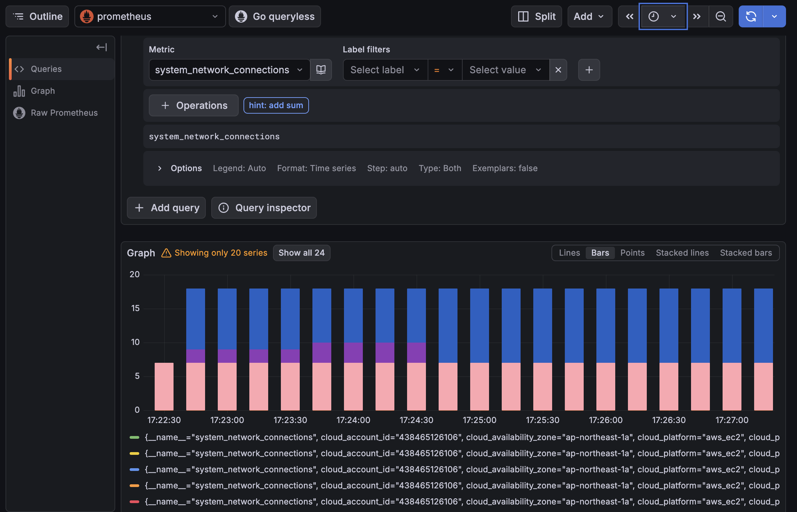
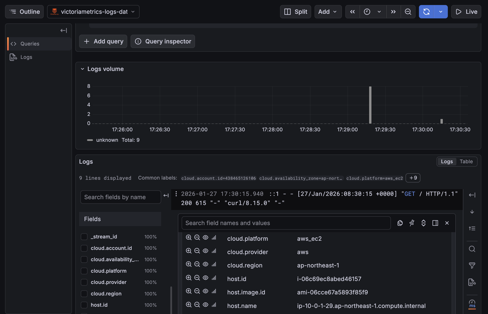

# otelcol-contribのインストール方法
```
# バージョン指定 (最新版を確認して変更してください)
OTEL_VERSION="0.144.0" 
# アーキテクチャ 
ARCH="amd64" 

# ダウンロード
wget https://github.com/open-telemetry/opentelemetry-collector-releases/releases/download/v${OTEL_VERSION}/otelcol-contrib_0.144.0_linux_amd64.rpm

# インストール
sudo rpm -ivh otelcol-contrib_${OTEL_VERSION}_linux_${ARCH}.rpm

# ログフォルダへのアクセス権付与(この場合nginxのログのみ)
setfacl -m u:otelcol-contrib:rx /var/log/nginx
getfacl /var/log/nginx
```
インストール後の仕上げ
```
# 1. 自動起動を有効化 (enable)
sudo systemctl enable otelcol-contrib

# 2. サービスを停止 (stop)
# ※ enableした状態でstopしておくのがAMI化の鉄則です。
# 次回インスタンス起動時(AMIからの起動時)に自動的にstartします。
sudo systemctl stop otelcol-contrib

# 3. 掃除
rm otelcol-contrib_${OTEL_VERSION}_linux_${ARCH}.rpm
```

# 結果
## メトリクス
* EC2のメトリクスを、インスタンスのラベルと一緒に確認できる

## ログ
* /var/log/nginx以下のファイルを、インスタンスのラベルと一緒に確認できる



# 確認事項
* otelcol-contribのパッケージをインターネットからダウンロードさせて良いか
* /var/logの読み込みのためにroot権限で起動するようになっているが、問題ないか
    * 問題ある場合、/var/logを読み込めるユーザーグループは何か

# memo
* service file: /usr/lib/systemd/system/otelcol-contrib.service
* default conf: /etc/otelcol-contrib/config.yaml
* otelcol自体のログを見る方法: journalctl -u otelcol-contrib --no-pager | tail